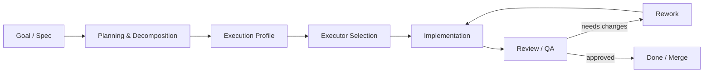

# AIKombinat

> **Experimental fork of [CLITrigger](https://github.com/HyperAITeam/CLITrigger)** for multi-agent AI workflows, autonomous development experiments, and other AI automation ideas.

[](https://github.com/bojlahg/AIKombinat/actions/workflows/ci.yml)
[](LICENSE)
[](https://github.com/HyperAITeam/CLITrigger)

AIKombinat starts from the excellent CLITrigger codebase and intentionally explores a more experimental direction.

The current main track is **AI-assisted and increasingly autonomous software development**: multiple coding CLIs, model discovery, execution profiles, task routing, isolated worktrees, review/rework loops, and eventually a resumable development pipeline that can keep working with limited human supervision.

The repository is also intentionally broader than coding alone. The long-term idea behind the name **AI Kombinat** is a collection of connected AI "workshops": coding is the first major one, but image generation, batch media workflows, transcription/audio, local models, and other useful AI automation may live here later.

> **Status:** experimental. Expect breaking changes, unfinished ideas, provider-specific edge cases, and features that may be redesigned or removed after testing.

---

## Fork relationship

AIKombinat is a fork of **CLITrigger** by HyperAI Team.

- Original project: [HyperAITeam/CLITrigger](https://github.com/HyperAITeam/CLITrigger)
- License: [MIT](LICENSE)
- Upstream copyright and license notices are preserved.
- AIKombinat is an independent experimental fork and is not presented as an official CLITrigger release or endorsed continuation.
- Bugs in unmodified upstream behavior may belong upstream; bugs or behavior specific to this fork belong here.
- Upstream changes may be selectively merged when they remain compatible with the direction of this fork.

See [UPSTREAM.md](UPSTREAM.md) for the relationship and sync policy.

---

## Why this fork exists

CLITrigger already provides a strong practical base: a web/desktop workspace around AI CLI agents, isolated git worktrees, tasks, schedules, sessions, discussions, review, and Git tooling.

AIKombinat keeps that foundation but experiments more aggressively with the layer above individual CLI calls:

- a persistent **Model Catalog** instead of assuming a small hardcoded model list;
- **Execution Profiles** that describe task classes and allowed executor/model/effort candidates;
- provider-native effort/reasoning settings;
- model discovery for Claude Code, Codex, and Antigravity;
- explicit handling of missing models and uncertain provider capabilities;
- user-controlled ordering of commonly used models;
- stronger execution snapshots and preflight validation;
- experiments toward executor availability, quota-aware routing, shared resources, review/rework, and autonomous pipelines.

Some of these features are already implemented; others are roadmap items. The distinction matters because software has suffered enough from READMEs describing alternate universes.

---

## The "DarkFactory" direction

**DarkFactory** is an internal direction/codename for the autonomous-development track, not the public name of this repository.

The intended shape is roughly:



The important part is not "more agents" by itself. The goal is a system that can:

1. understand a goal or specification;
2. split it into traceable work;
3. choose an eligible executor at runtime;
4. respect model availability, quotas, and shared resources;
5. execute in isolated worktrees;
6. review the result;
7. request rework when needed;
8. resume safely after failures or resource waits;
9. leave a complete audit trail for the human operator.

The planned stages are documented in [ROADMAP.md](ROADMAP.md).

---

## Beyond autonomous coding

AIKombinat is deliberately not named around one workflow such as "vibe coding" or even one model family.

Possible future experimental areas include:

- batch image generation and image-processing jobs;
- multimodal asset pipelines;
- transcription, summarization, and audio workflows;
- local model execution;
- generic scheduled AI jobs;
- reusable resource pools such as GPU, emulator, editor, or local inference capacity;
- pipelines that combine coding and non-coding AI tools.

These are directions, not promises. Coding-agent orchestration remains the main working track today.

---

## Current foundation

AIKombinat inherits a large amount of functionality from CLITrigger, including:

- project-based workspaces;
- TODO/task execution in isolated git worktrees;
- Claude Code, Codex, and Antigravity adapters;
- interactive terminal sessions;
- schedules and automated task starts;
- multi-agent discussions;
- review queue and Git integration;
- project knowledge/docs and planning tools;
- MCP integration;
- local web UI and Electron desktop packaging;
- SQLite-backed persisted state.

For the original CLITrigger feature set and upstream documentation, see the [CLITrigger repository](https://github.com/HyperAITeam/CLITrigger) and its [Wiki](https://github.com/HyperAITeam/CLITrigger/wiki).

The inherited `README_KR.md` is an upstream-oriented snapshot and may not describe AIKombinat-specific experiments.

---

## Experimental fork features

Recent AIKombinat-specific work includes:

### Model Catalog

A mutable SQLite catalog for provider models with:

- provider/model identity;
- discovered vs manual entries;
- availability / missing state;
- provider-native supported efforts when known;
- manual capability overrides;
- stable user-defined ordering;
- safe refresh semantics that avoid mass-marking models missing after weak or malformed discovery.

### Execution Profiles

Execution profiles describe **what kind of executor is acceptable for a class of task**, rather than binding a task to one model at creation time.

A profile contains ordered executor candidates:

```text
Execution Profile
  -> Claude / model / effort
  -> Codex / model / effort
  -> Antigravity / model / effort
```

The concrete executor is resolved at execution time, leaving room for future availability-, quota-, and resource-aware selection.

### Provider discovery experiments

The fork is actively testing model/capability discovery against changing provider CLIs. These integrations are intentionally defensive because CLI output formats and account-level availability change more often than anyone would reasonably enjoy.

---

## Running AIKombinat

### From source

```bash
git clone https://github.com/bojlahg/AIKombinat.git
cd AIKombinat

npm ci
cd src/client && npm ci && cd ../..

npm run dev
```

Then open the local URL printed by the server (normally `http://localhost:3000`).

### Validation

```bash
npm run typecheck
npm test
npm run build
```

CI runs Type Check, Server Tests, Client Tests, Build, and a final CI Gate on `main` and pull requests.

### Important package note

The npm package **`clitrigger` belongs to the upstream CLITrigger project**. Installing `clitrigger` from npm does **not** mean you are installing the AIKombinat fork.

Until this fork gets its own release/package identity, treat AIKombinat as a **source-first experimental repository**.

---

## Development philosophy

A few rules guide the fork:

- prefer explicit, inspectable state over hidden provider magic;
- do not silently change requested model/effort semantics;
- failed discovery must preserve the last known-good catalog;
- keep experimental features replaceable until they prove useful;
- make autonomous behavior observable and recoverable;
- separate provider-specific adapters from generic orchestration;
- preserve a path for selectively taking useful upstream fixes.

See [AGENTS.md](AGENTS.md) for repository-specific development instructions.

---

## Stability and data

This repository is under active experimentation. Database migrations and configuration semantics may change between commits.

Before testing a large migration or automation change against important projects, back up the application data and repository state. Autonomous software is much more charming when it has an undo button.

---

## Documentation

- [ROADMAP.md](ROADMAP.md) - experimental directions and the DarkFactory-style development track
- [UPSTREAM.md](UPSTREAM.md) - fork attribution and upstream relationship
- [AGENTS.md](AGENTS.md) - development/agent instructions
- [CLITrigger upstream](https://github.com/HyperAITeam/CLITrigger) - original project and baseline documentation

---

## ⚡ Fuel the Kombinat

Coffee works for humans. AIKombinat mostly burns tokens.

If you want to support development, a **Claude gift subscription** or **ChatGPT/Codex gift credits** are considerably more useful here than a cup of coffee.

Gift flows usually produce a redeem/share link rather than a permanent public recipient URL, so send the gift link via Telegram:

<div align="center">

[](https://t.me/bojlahg)

</div>

Please do **not** send passwords, API keys, session tokens, or account credentials. Only gift/redeem links intended to be shared.

---

## License

AIKombinat is distributed under the [MIT License](LICENSE), inherited from CLITrigger.

The original copyright notice is preserved in `LICENSE`. AIKombinat contains modifications and experimental features built on top of the upstream project.
